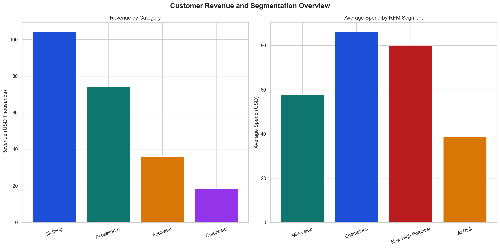

# Customer Behavior & Revenue Insights Analysis

## Business Problem

Retail and consumer teams often have transaction data but still struggle to answer the questions leaders actually care about: which customers are worth protecting, which segments are drifting into churn risk, and where revenue concentration should shape promotions and retention spend. This project turns raw shopping behavior into a commercially useful customer decision framework.

## Objective

Build an end-to-end customer analytics workflow that:

- resolves a full local dataset without uploading it to GitHub
- cleans and standardizes customer transaction records
- engineers RFM-style, lifetime-value, and retention-priority fields
- exports summary tables, SQL-ready data, and dashboard visuals

## Dataset Strategy

- Full dataset: stored locally in `data/raw/` and excluded from GitHub
- GitHub-safe sample: `data/sample/customer_shopping_behavior_sample.csv`
- Processed outputs: exported to `data/processed/`
- Automated ingestion options:
  - local path via `CUSTOMER_BEHAVIOR_DATA_PATH`
  - Google Drive via `data/data_sources.json`
  - Kaggle via `data/data_sources.json`
  - sample fallback for GitHub reviewers

## Project Structure

```text
Customer Behavior & Revenue Insights Analysis/
├── assets/
├── dashboard/
├── data/
│   ├── raw/
│   ├── sample/
│   └── processed/
├── notebooks/
├── reports/
├── scripts/
│   └── sql/
├── README.md
└── requirements.txt
```

## Methodology

1. Bootstrap the raw file from local storage, Google Drive, Kaggle, or sample data.
2. Standardize columns and clean data types.
3. Impute missing review ratings and build analytical customer features.
4. Create `customer_lifetime_segment`, `rfm_segment`, `customer_priority_score`, and `retention_risk_flag`.
5. Export cleaned data plus reusable summary tables for business review.
6. Load the transformed customer table into SQLite and validate the SQL pack.
7. Generate recruiter-facing dashboard assets for GitHub presentation.

## KPIs Used

- Total Revenue
- Total Customers
- Average Purchase Amount
- Average Review Rating
- Revenue by Category
- Revenue by Subscription Status
- RFM Segment Revenue
- Priority Tier Revenue
- Top Location Revenue
- Payment Method Revenue

## Key Insights

- The dataset captures **3,900 customers** and **$233.08K** in total revenue.
- `Clothing` and `Accessories` generate **$178.46K**, or roughly **76.6%** of total revenue.
- Non-subscribers contribute **$170.44K**, equal to **73.1%** of revenue, which creates a strong conversion opportunity.
- Only **611 Protect-tier customers** account for **$49.23K** in revenue with an average spend of **$80.57**.
- The pipeline flags **229 high-risk customers**, giving the project a practical retention action layer instead of descriptive reporting only.

## Business Recommendations

- Protect the highest-priority customers with retention campaigns, early-access offers, and service recovery monitoring.
- Focus subscription conversion on high-spend non-subscribers instead of using broad discounting.
- Use category and location concentration to target promotions where demand quality is already strongest.

## Measurable Business Impact

If the business converts just **10%** of current non-subscriber revenue into subscription-linked revenue, it could shift approximately **$17.04K** into a more retainable customer segment.

## Dashboard Screenshot



## How To Run

### 1. Install dependencies

```bash
python3 -m pip install -r requirements.txt
```

### 2. Choose a data path

Option A: use the local full dataset

```bash
python3 scripts/bootstrap_data.py
```

Option B: configure Google Drive or Kaggle

```bash
cp data/data_sources.example.json data/data_sources.json
python3 scripts/bootstrap_data.py
```

Option C: use the GitHub-safe sample

```bash
python3 scripts/customer_behavior_revenue_insights.py --use-sample --load-to-sqlite
```

### 3. Run the full workflow

```bash
python3 scripts/run_pipeline.py
```

### 4. Export recruiter-facing chart assets

```bash
python3 scripts/export_dashboard_assets.py
```

## Main Outputs

- `data/processed/customer_behavior_transformed.csv`
- `data/processed/customer_kpis.csv`
- `data/processed/revenue_by_category.csv`
- `data/processed/revenue_by_subscription_status.csv`
- `data/processed/customer_lifetime_segments.csv`
- `data/processed/rfm_segment_summary.csv`
- `data/processed/priority_tier_summary.csv`
- `data/processed/payment_summary.csv`
- `data/processed/customer_behavior.db`

## Why This Project Is Portfolio-Ready

- Shows business-ready segmentation instead of only basic descriptive analytics.
- Solves the GitHub large-file problem cleanly with sample fallback and configurable ingestion.
- Includes SQL validation, reusable summary tables, and recruiter-facing visuals.
